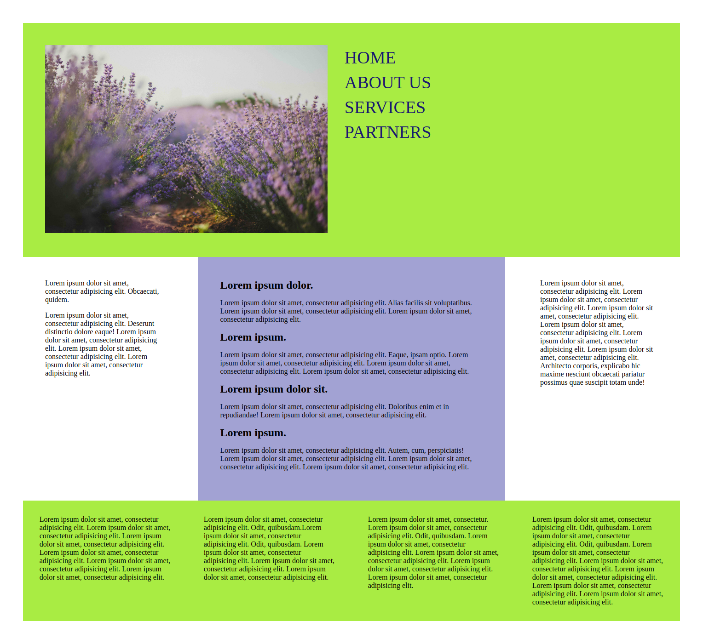

# page

Трёхколоночный макет с использованием семантической разметки.

Макет не адаптивный, не кроссбраузерный (нормально смотрится в Google Chrome), не имеет мобильной версии.

Вёрстка по шаблону:

Результат:

###### Страница размещена на [github pages](https://elviracher.github.io/page/)
